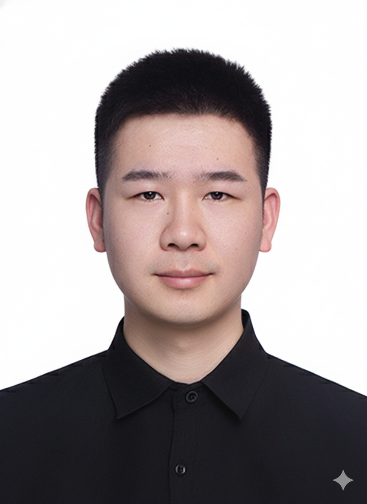
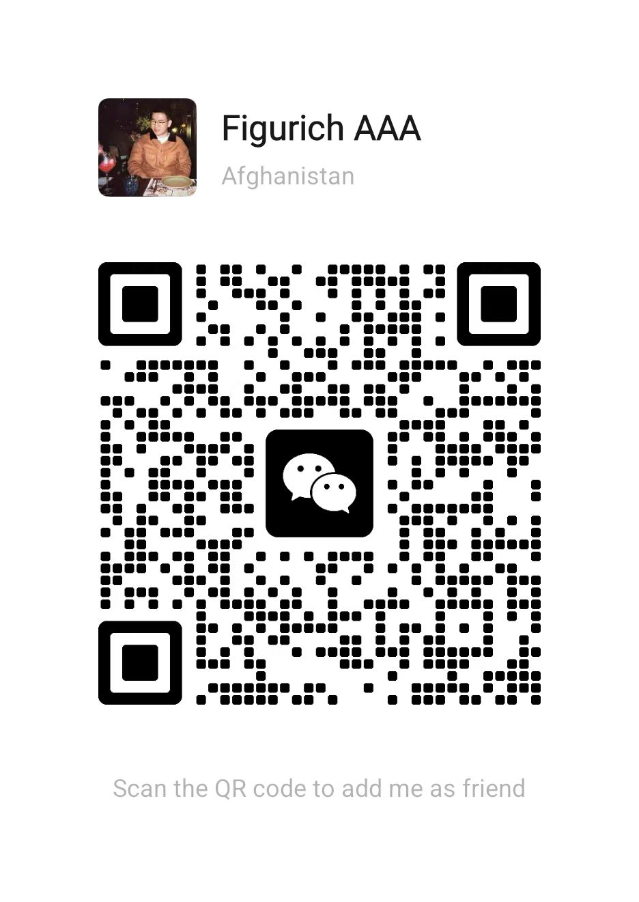

---
marp: true
paginate: true
---

# AI赋能的个人品牌和社交平台影响力构建策略

### 在校研究生可用的路线图

#### 舒爱杰

---

## **个人简介**

- REFLEXDAO 健康数据分析平台高级工程师，聚焦 AI × 积极心理学 × 数字健康
- 主导并上线 3 个社交类健康应用，熟悉海外市场增长与合规落地
- 擅长将科研成果与产品化结合，把数据洞察转成用户价值
- 丹麦技术大学 AI 与大数据方向硕士，访学美国威斯康辛大学
- 多年海外生活学习经历，有各种趣点、槽点可分享

**希望我的经历和经验能给大家带来新鲜的视角**

--- 
<!-- header: '🎯 **开场** · 问题引入' -->
<!-- ## **第2页：Attention - 开场钩子** -->

## **三个残酷的真相**

### **真相1：学历内卷**
- 2024年硕士毕业生：**超百万人**
- “好工作”数量：没有翻倍
- 硕士学历：从“稀缺资源”变成“入场券”

### **真相2：同质化竞争**
- 同样的课程、同样的项目、同样的简历
- **只能凭GPA和论文脱颖而出？**

### **真相3：AI降维打击**
- ChatGPT通过医学执照考试、写法律文书、生成专业代码
- **企业偏好有经验的老人+AI，导致新人培养断代**

---

<!-- ## **第3页：Attention - 反直觉解决方案** -->

## **答案：建立个人品牌**

### **为什么？**

| ❌ 传统思维                  | ✅ 个人品牌思维                |
| --------------------------- | ----------------------------- |
| AI可以学会你的技能          | AI无法复制你的经历和视角      |
| 雇主能找到100个会Python的人 | 只有1个用你的方式思考问题的人 |
| 你是"被挑选者"              | 你是"被邀请者"                |

---
## **今天的内容地图**
1. 品牌架构：找到你的"个人垄断"
2. 内容引擎：系统化生产（每周3小时）
3. 平台执行：Twitter/YouTube/LinkedIn具体策略
4. 商业价值：提前认识从0到100万粉丝的升级蓝图

---
<!-- header: '💡 **认知** · 思维转变' -->
<!-- ## **第4页：Perspective - 三大认知陷阱** -->

## **研究生的三大认知陷阱**

### **陷阱1：技能堆叠陷阱**
看招聘要求 → 学对应技能 → 考证书 → 投简历
- 当10万人都这么想，你进入“红海竞争”
- 技能让你“合格”，无法让你“不可替代”

### **陷阱2：被动价值接受者**
- 你的价值由HR定义（薪资固定）
- 你的发展由组织架构决定（晋升有限）
- 你的议价权接近于零（因为可替代）

### **陷阱3：忽视经历资产**
- “我只是个普通学生”
- “我的研究方向太小众”
- “我没有大厂实习经历”

❌ **这是最大的误解！**

---

<!-- ## **第5页：Perspective - 体验模型** -->

## **核心认知转变：体验模型**

### **你最独特的资产 ≠ 你学了什么技能**
### **你最独特的资产 = 你如何看待世界**

这种"如何看待世界"由你独一无二的：
- 生活经历
- 失败教训
- 思考路径

塑造而成 → **这就是"体验模型"**

---

<!-- ## **第6页：Perspective - 对比案例** -->

## **普通求职者 vs 个人品牌建设者**

| 维度         | 普通求职者                       | 个人品牌建设者                                        |
| ------------ | -------------------------------- | ----------------------------------------------------- |
| **简历**     | "我会Python、数据分析、机器学习、发表过xx论文" | "我用机器学习预测学生辍学率，帮助3所学校优化资源配置" |
| **价值主张** | "我能做数据分析，科研能力出众"                 | "我能用数据讲故事，让非技术人员理解复杂模型"          |
| **竞争定位** | 和1万个会Python科研的人竞争         | 在"教育×数据×叙事"交叉点建立垄断                      |
| **结果**     | 被动等待offer                    | 主动收到邀请                                          |

**关键差异：不是"更优秀"，而是"定位不同"**

---

<!-- ## **第7页：Perspective - 认知转变** -->

## **从“找工作”到“创造不可替代性”**

### **旧思维**
我要找到好工作 → 学市场需要的技能 → 让简历好看

### **新思维**
我要成为某细分领域的“唯一选择” → 基于独特经历建立个人垄断 → 让机会主动找我

### **成功建立个人品牌后**
- ✅ 不再投简历，而是收到邀请
- ✅ 不再被动接受offer，而是主动定价
- ✅ 不再担心被替代，价值由独特性决定

---
<!-- header: '🏗️ **框架** · 四大支柱' -->
<!-- ## **第8页：Advantage - 框架总览** -->

## **完整的个人品牌战略规划框架**

### **四大支柱**

支柱1：品牌架构

**三兴趣交叉法**
**社交杠杆三大支柱**
**个人资料优化**

支柱2：内容引擎

**三点内容生态系统**
**内容飞轮（1份努力→10条内容）**
**内容合成系统**

支柱3：平台执行

**Twitter（基础）**
**YouTube（深度）**
**LinkedIn（专业）**

支柱4：商业价值

**价值阶梯设计**
**引流磁铁**
**变现路径**

---
<!-- header: '🏗️ **框架** · 支柱1：品牌定位' -->
<!-- ## **第9页：支柱1 - 三兴趣交叉法（案例：罗翔）** -->

## **三兴趣交叉法：构建你的专精领域（DoM）**

**三兴趣 = Niche of One 的核心**
- **赚钱的兴趣（Money-Making）**：可变现的技能/教练/产品，内容里保持 80% 专业度先立权威。
- **令人兴奋的兴趣（Exciting）**：天生痴迷、聊起来停不下来的领域，为内容注入能量与特定知识。
- **互补的兴趣（Complementary）**：辅助视角，推荐自我发展/心智掌握，帮助融合出独特观点。

**战略功能**
- 差异化：组合独特，自动避免同质化。
- 内容火力：三兴趣提供“数字乐高”（故事/隐喻/类比）覆盖多平台。
- 体验模型：兴趣是“如何”，你的经历是“为什么”，共同塑造个人垄断。

---

## **罗翔老师的三兴趣交叉**

| 兴趣类型           | 罗翔的选择                           | 为什么有效                   |
| ------------------ | ------------------------------------ | ---------------------------- |
| **能赚钱的兴趣**   | 刑法教学（本职工作）                 | 专业技能，有市场需求         |
| **让他兴奋的兴趣** | 哲学和人文思辨 （康德、卢梭）     | 让课程充满激情，学生能感受到 |
| **互补的兴趣**     | 段子和网络文化（"法外狂徒张三"） | 让严肃法律变有趣，年轻人爱看 |

### **结果：个人垄断**
- ❌ 只会刑法的老师：全国几千个
- ⚠️ 会刑法+哲学的老师：几百个
- ✅ 会刑法+哲学+讲段子：**只有罗翔**

**你或许不是最优秀的，但你是唯一的**

---

<!-- ## **第10页：支柱1 - 三兴趣交叉法（案例：李永乐）** -->

<!-- ## **李永乐老师的三兴趣交叉**

| 兴趣类型           | 李永乐的选择       | 具体体现                           |
| ------------------ | ------------------ | ---------------------------------- |
| **能赚钱的兴趣**   | 物理和数学教学     | 人大附中物理老师，本职工作         |
| **让他兴奋的兴趣** | 科普和教育         | 喜欢把复杂概念讲简单               |
| **互补的兴趣**     | 社会热点和生活现象 | 用物理解释股票暴跌/航空航天等热点事件 |

### **关键洞察**
这三个兴趣看似无关，但交叉后产生独特价值：
- 用物理知识解释生活现象
- 用教育热情让科学变有趣
- 用热点话题吸引大众关注

**= 李永乐的"个人垄断"**

--- -->

<!-- ## **第11页：支柱1 - 你的三兴趣交叉** -->

<!-- ## **现场练习：定义你的三兴趣**

| 兴趣类型           | 选择标准                        | 举例（要具体到行动层面，不要用抽象名词）                                                                    |
| ------------------ | ------------------------------- | ----------------------------------------------------------------------------------- |
| **能赚钱的兴趣**   | 你现在就在做的 | • 数字化转型/供应链韧性案例的ROI测算 • 服务运营排班/收益管理优化（酒店/零售实训）  |
| **令人兴奋的兴趣** | 研究生之前就有的长期痴迷      | • 高中辩论/模联训练的说服与结构化表达 • 运营社团/赛事，痴迷组织体验设计与激励 • 长期看体育/音乐/影视并做复盘，类比商业叙事 |
| **互补的兴趣**     | 最近在琢磨的辅助视角                | • 大模型/智能体能否做OKR校对与绩效辅助手 • 混合办公中线下ritual如何提升黏性  |

**❌ 不要写**："组织行为学怎么怎么样"
**✅ 要写**："为什么团队总有人划水"

--- -->

<!-- ## **第12页：支柱1 - 社交杠杆三大支柱** -->

## **社交杠杆三大支柱**

### **前6-12个月，所有内容都应服务这三个目标**

| 支柱                     | 定义              | 如何实现                               | 内容类型                               |
| ------------------------ | ----------------- | -------------------------------------- | -------------------------------------- |
| **增长 Growth**       | 粉丝持续增加      | 创作易分享、有争议、 提供价值的内容 |  清单体/ 对比类/极端建议     |
| **权威 Authority**    | 深度+ 社交证明 | 系统性教育受众， 展示成就           | 长文分析/案例拆解/原创框架 |
| **真实 Authenticity** | 记录真实经历      | 分享学习过程、 失败教训             | 研究日记/复盘反思/个人故事 |

**关键洞察**：大多数人只关注"增长"
**但真正变现需要"权威"+"真实"**

---

<!-- ## **第13页：支柱1 - 个人资料优化** -->

## **个人资料优化清单**

| 元素       | 要点                                   | 示例（研究生）                                                                                |
| ---------- | -------------------------------------- | --------------------------------------------------------------------------------------------- |
| **头像**   | • 光线好 • 面部清晰 • 专业休闲风 | 用手机拍，白墙背景即可                                                                        |
| **简介**   | • 避免"我帮助X实现Y" • 展示独特定位 | ❌ "MBA在读，帮助企业提升效率"  ✅ "用行为科学拆解商业世界 &#124; 在公开学习管理×心理×游戏化" |
| **头图**   | 展示核心产品或愿景                     | 你的Newsletter标题 + 核心价值主张                                                            |
| **链接**   | 指向Newsletter订阅页                   | Substack/Beehiiv链接                                                                          |
| **置顶帖** | • 高互动帖 • 个人故事 • 入门建议 | "我从0到2000粉学到的5件事" |

---
<!-- header: '🏗️ **框架** · 支柱2：内容引擎' -->
<!-- ## **第14页：支柱2 - 三点内容生态系统** -->

## **三点内容生态系统**

### **分层策略：平衡深度、增长、测试**

| 内容层级     | 主要形式                                            | 战略目的                                   | 核心CTA        | 创作时间  |
| ------------ | --------------------------------------------------- | ------------------------------------------ | -------------- | --------- |
| **长篇内容** | • Newsletter • YouTube深度视频 • LinkedIn长文 | • 建立深度信任 • 展示权威 • 商业转化 | 购买产品/服务  | 60分钟/周 |
| **中篇内容** | • Twitter Thread • LinkedIn中文                  | • 平衡增长与深度 • 引流到长篇           | 订阅Newsletter | 30分钟/周 |
| **短篇内容** | • Twitter短推 • LinkedIn单帖                     | • 创意测试 • 保持活跃度                 | 高互动引流     | 20分钟/天 |

**总时间投入：每周3小时**

---

<!-- ## **第15页：支柱2 - 内容飞轮** -->

## **内容飞轮：1份努力 → 10条内容**

### **每周工作流程（3小时）**

**📅 周日晚（60分钟）**

写1篇Newsletter
- 800-1200字
- 主题：本周学到的反直觉洞察

**📝 工作日（每天20分钟）**

从Newsletter拆解5个核心观点
- 每个观点 = 1条Twitter/LinkedIn帖子
- 表现最好的帖子 → 扩展成Thread

**🤝 周六（60分钟）**

互动与网络建设
- 在大V帖子下写高质量评论
- 回复粉丝，建立连接

---

<!-- ## **第16页：支柱2 - 内容飞轮案例** -->

## **内容飞轮实战案例**

### **管理学研究生的一周内容**

**周日Newsletter**：
"为什么OKR在中国企业水土不服？我分析的3个文化因素"

**周一-周五短内容拆解**：
- **周一**："中国企业学OKR失败的第一原因：我们把'目标'当成了'KPI'..."
- **周二**："为什么谷歌的透明文化在中国行不通？儒家文化的3个影响..."
- **周三**："字节跳动如何本土化OKR？他们做对了这件事..."
- **周四**："案例：华为的'绩效'vs阿里的'价值观'，哪个更适合你的公司？"
- **周五**："如果你只能用一个指标衡量团队，应该选什么？"

**结果**：1篇Newsletter = 5条Twitter帖子 = 1周内容

---

<!-- ## **第17页：支柱2 - 内容合成系统** -->

## **内容合成系统：永不枯竭的灵感来源**

| 输入源      | 捕捉工具              |
| ----------- | --------------------- |
| 书籍        | NotebookLM              | 
| 学术论文    | NotebookLM              |
| YouTube讲座 | NotebookLM + 沉浸式翻译会员 |
| 播客        | 通义听悟                  |
| 课堂笔记    | Obsidian + Claude Code   Notion AI | 

<b>The Epistemic Method 认识论方法</b>

| 步骤 | 行动要点           | 简要示例                     |
| ---- | ------------------ | ---------------------------- |
| 1. 观察 | 捕捉高信噪比想法     | 午后散步时灵感与效率相关的记录 |
| 2. 研究 | 用数据/理论佐证观点 | 查心流与深度工作资料           |
| 3. 实验 | 设计小实验验证假设   | 连续一周30-60分钟步行并记笔记  |
| 4. 发现 | 提炼可分享的新洞察   | 散步听有声书并记录高价值片段   |
| 5. 理论 | 连接发现形成框架     | 提出“心流步行”视角             |
| 6. 流程 | 标准化可复用步骤     | 固化“问题分解+防分心”流程       |

---
<!-- header: '🏗️ **框架** · 支柱3：平台执行' -->
<!-- ## **第18页：支柱3 - Twitter策略** -->

## **Twitter：基础平台**

**为什么从Twitter开始？**
- ✅ 强大的分享功能（一键转发）
- ✅ 可高频测试（每天多条不会引起反感）
- ✅ 写作是所有内容的基础

**高影响力推文模板**

| 模板类型     | 公式                                   | 示例                                                        |
| ------------ | -------------------------------------- | ----------------------------------------------------------- |
| **清单体**   | [数字]个[结果]的 [方法/习惯/错误] | 7个让你研究效率翻倍的习惯                             |
| **个人定义** | [概念]不是[误解]，而是[真相]    | 自律不是“逼自己”，而是“重新设计环境”                  |
| **对比重复** | [A做X，B做Y，C做Z]                | 普通人抱怨环境，优秀人改变环境，卓越人创造环境    |
| **极端建议** | 做[极端行动]。[时间]后你会[结果] | 删掉所有社交媒体，读50本书，3个月后你不会认识自己 |

---

<!-- ## **第19页：支柱3 - Twitter增长关键** -->

## **Twitter初学者增长关键**

### **不是疯狂发帖，而是高质量互动**

**每天15分钟策略**：
在大V的热门帖子下写**补充价值**的回复

**❌ 低质量回复**：
- "说得好！"
- "学到了，感谢分享"
- "太有道理了"
- "俺也一样"

**✅ 高质量回复**：
- 提供**补充案例**："这让我想到另一个例子..."
- 提供**数据支撑**："根据XXX研究，这个现象背后的原因是..."
- 提供**新视角**："从另一个角度看，这其实反映了..."
- 提出**深刻问题**："如果是XX情况，这个方法还适用吗？"

**结果**：一个高质量回复 = 一篇迷你推文 = 精准关注

---

<!-- ## **第20页：支柱3 - YouTube策略** -->

## **YouTube：深度信任平台**

### **最简单的启动方法**

**步骤**：
1. 每周写Newsletter时，对着手机摄像头讲述内容（30-60分钟）
2. 不需要复杂剪辑，直接上传
3. 标题用Newsletter的标题即可

**为什么这样做？**
- YouTube算法更看重**内容质量**，不是制作质量
- Newsletter → YouTube = 内容复用
- 真人出镜 = 建立深度信任

### **战略定位**
YouTube是"真实性"支柱的延伸，而非初期增长渠道

---

<!-- ## **第21页：支柱3 - LinkedIn策略** -->

## **LinkedIn：专业影响力平台**

### **与Twitter的3大区别**

| 维度         | Twitter      | LinkedIn                       |
| ------------ | ------------ | ------------------------------ |
| **钩子**     | 可以循序渐进 | 必须前两句直接说价值           |
| **内容长度** | 280字-长推   | 1000-2000字深度内容            |
| **流量密码** | 转发         | **评论**（评论=Twitter的转发） |

### **内容复用策略**

Twitter Thread（500字）=> 扩展成LinkedIn文章（1500字） => 增加更多案例和数据 => 调整语气（更专业，少用网络梗）

### **关键策略**
所有互动应以**鼓励评论**为核心
因为评论才能让你的内容出现在他人信息流

---

<!-- ## **第22页：支柱3 - 平台时间分配** -->

## **平台时间分配（初期）**

### **总投入：每天2-3小时**

| 平台         | 时间占比 | 具体任务                                                 | 为什么这样分配                                 |
| ------------ | -------- | -------------------------------------------------------- | ---------------------------------------------- |
| **Twitter**  | 60%      | • 每天2-3条短推 • 每周1-2个Thread • 每天15分钟互动 | 基础平台，测试想法， 写作能力是所有内容基础 |
| **LinkedIn** | 25%      | • 每周2-3篇内容 • 复用Twitter内容                     | 专业影响力， B2B机会                        |
| **YouTube**  | 15%      | • 每周1个视频 • 复用Newsletter                        | 深度信任， 后期高转化                       |

### **进阶后调整**
随着粉丝增长，逐步增加YouTube占比，因为YouTube是长期资产

---
<!-- header: '🏗️ **框架** · 支柱4：商业价值' -->
<!-- ## **第23页：支柱4 - 核心思想** -->

## **支柱4：商业价值**

### **核心思想：杠杆优先于金钱**

**不要急着变现！**

**前6个月专注于**：
1. 建立权威
2. 积累受众
3. 测试方向

**为什么？**
- 短期金钱收入是有限的
- 高杠杆品牌带来源源不断的机会
- 最终回报远超金钱本身

**真实的案例就是**：
有一个我很敬仰的大佬, 有次针对我的问题找到我讨论，我毫不犹豫的就付给他3000美元获得解决方案
**这就是杠杆的力量：让销售变得多余**

---

<!-- ## **第24页：支柱4 - 价值阶梯** -->

## **价值阶梯设计**

| 阶梯    | 产品类型                         | 价格           | 推出时机 | 目标         |
| ------- | -------------------------------- | -------------- | -------- | ------------ |
| **0级** | 免费内容(Twitter/Newsletter) | $0             | 第1天    | 建立信任     |
| **1级** | 引流磁铁 (电子书/清单)        | $0 (换邮箱) | 1-3个月  | 建立邮件列表 |
| **2级** | 低价产品 (迷你课程/模板)      | $29-99         | 3-6个月  | 测试变现     |
| **3级** | 核心产品(完整课程/社群)      | $199-999       | 6-12个月 | 规模化收入   |
| **4级** | 高端服务(咨询/教练)          | $2000+         | 12个月后 | 高价值客户   |

**客户旅程**：免费内容 → 引流磁铁 → 低价产品 → 核心产品 → 高端服务
**信任递增，价格递增**

---

<!-- ## **第25页：支柱4 - 引流磁铁示例** -->

## **引流磁铁：研究生可做的**

### **引流磁铁就是免费但极具价值的资源，用户要用邮箱交换**

| 类型       | 示例                       | 为什么有效             |
| ---------- | -------------------------- | ---------------------- |
| **模板库** | "某领域研究生文献阅读的50个模板" | 直接解决痛点，立即可用 |
| **清单**   | "某领域学术PPT设计的30个原则"    | 可打印，反复参考       |
| **公式集** | "某领域顶会论文标题的100个公式"  | 降低创作门槛           |
| **框架**   | "某领域公司面试的20个框架"   | 系统化知识             |
| **案例库** | "某领域商业案例分析的模板库"     | 学习榜样               |

### **关键洞察**
制作引流磁铁的过程 = 建立权威的过程
**这是"一石二鸟"的策略**

---
<!-- header: '🎮 **进阶** · 段位系统' -->
<!-- ## **第26页：Gameify - 段位系统总览** -->

## **个人品牌王者段位系统**

### **完整路线图**

| 段位            | 粉丝数    | 月收入     | 核心任务             |
| --------------- | --------- | ---------- | -------------------- |
|  **倔强青铜**  | 0-500     | $0         | 建立存在感，找到声音 |
| **秩序白银**  | 500-2K    | $0-500     | 建立权威，测试方向   |
| **荣耀黄金**  | 2K-10K    | $500-2K    | 规模化产出，建立系统 |
| **尊贵铂金**  | 10K-50K   | $2K-10K    | 推出产品，规模化变现 |
| **永恒钻石** | 50K-200K  | $10K-50K   | 旗舰产品，业务系统   |
| **至尊星耀**  | 200K-500K | $50K-150K  | 规模化业务，建立团队 |
| **最强王者** | 500K-1M   | $150K-500K | 个人IP帝国           |
| **超凡大师**  | 1M+       | $500K+     | 行业定义者           |

---

<!-- ## **第27页：段位系统详细地图（上）** -->

## **倔强青铜 → 荣耀黄金**

| 段位         | 粉丝数 | 时间投入     | 内容配比                                                     | 盈利模式                               | 任务清单                                                                                                                              |
| ------------ | ------ | ------------ | ------------------------------------------------------------ | -------------------------------------- | ------------------------------------------------------------------------------------------------------------------------------------- |
| **倔强青铜** | 0-500  | 1-2小时/天   | Twitter 70% Newsletter 20% LinkedIn 10%                | 无                                     | ☑️ 优化个人简介 ☑️ 定义三兴趣交叉 ☑️ 在10个大V帖子下评论 ☑️ 启动Newsletter（4篇） ☑️ 发布100条推文         |
| **秩序白银** | 500-2K | 2-3小时/天   | Twitter 60% Newsletter 30% LinkedIn 10%                | 小额打赏    | ☑️ 启动内容飞轮 ☑️ Newsletter订阅破100 ☑️ 完成3次非索取型社交 ☑️ 分析前10篇爆款 |
| **荣耀黄金** | 2K-10K | 15-20小时/周 | Twitter 40% Newsletter 30% YouTube 20% LinkedIn 10% | 付费Newsletter 小额赞助 | ☑️ 启动YouTube（12个视频） ☑️ 完成第一个引流磁铁 ☑️ Newsletter订阅破1000 ☑️ 建立付费Newsletter  |

---

<!-- ## **第28页：段位系统详细地图（中）** -->

## **尊贵铂金 → 永恒钻石**

| 段位         | 粉丝数   | 时间投入                 | 内容配比                                                     | 盈利模式                                                       | 任务清单                                                                                                                    |
| ------------ | -------- | ------------------------ | ------------------------------------------------------------ | -------------------------------------------------------------- | --------------------------------------------------------------------------------------------------------------------------- |
| **尊贵铂金** | 10K-50K  | 25-30小时/周 (可全职) | Twitter 30% YouTube 30% Newsletter 25% LinkedIn 15% | 低价产品($29-99) 联盟营销               | ☑️ 推出第一个付费产品 ☑️ 销售漏斗优化 ☑️ YouTube订阅破5000 ☑️ 建立自动化邮件序列 |
| **永恒钻石** | 50K-200K | 30-40小时/周             | YouTube 35% Newsletter 30% Twitter 20% LinkedIn 15% | 旗舰课程($199-999) 咨询服务($2K-5K) 付费社群($99-299/年) | ☑️ 推出旗舰课程 ☑️ 或开启咨询服务 ☑️ 建立付费社群 ☑️ 雇佣VA（虚拟助理） ☑️ 外包视频剪辑/设计 ☑️ 年收入破$100K      |

---

<!-- ## **第29页：段位系统详细地图（下）** -->

## **至尊星耀 → 超凡大师**

| 段位         | 粉丝数    | 时间投入                 | 内容配比                                 | 盈利模式                                                | 任务清单                                                                                                                     |
| ------------ | --------- | ------------------------ | ---------------------------------------- | ------------------------------------------------------- | ---------------------------------------------------------------------------------------------------------------------------- |
| **至尊星耀** | 200K-500K | 40+小时/周 (团队运营) | 产品线优化 团队分工 策略调整       | 多产品矩阵 企业培训($10K-50K/场) 演讲($5K-20K/次) | ☑️ 推出多个产品线 ☑️ 建立3人以上团队 ☑️ 外包大部分内容制作 ☑️ 策划大型活动/峰会/企业培训 ☑️ 接受主流媒体采访 |
| **最强王者** | 500K-1M   | 团队运营 战略决策     | 生态布局 投资孵化 品牌授权         | 版税收入 股权投资 品牌授权            | ☑️ 出版实体书 ☑️ 建立创作者孵化器 ☑️ 品牌授权合作 
| **超凡大师** | 1M+       | 战略决策 影响力塑造   | 生态系统运营 社会影响力 思想领导力 | 生态系统收入 品牌价值 战略投资 政策影响        | ☑️ TED演讲                       |

---
<!-- header: '🚀 **行动** · 立即开始' -->
<!-- ## **第30页：关键成功要素** -->

## **跨所有段位的关键成功要素**

### **1. 一致性 ＞ 完美主义**
每周发布 ＞ 偶尔完美

### **2. 深度 ＞ 数量**
1篇深度内容 ＞ 10篇平庸内容

### **3. 真实 ＞ 包装**
真实经历 ＞ 完美人设

### **4. 价值 ＞ 销售**
先给予价值，销售会自然发生

### **5. 长期主义**
- **前6个月**：积累期（增长慢是正常的）
- **6-12个月**：突破期（开始看到复利效应）
- **12个月后**：指数增长期

 

**🎯 记住：这是马拉松，不是短跑**

---

<!-- ## **第31页：今晚就做的3件事** -->

## **你的第一步**

### **今晚回去就做（35分钟）**

**1. 定义你的三兴趣交叉（5分钟）**
- 打开手机备忘录
- 写下：能赚钱的、让你兴奋的、好奇的
- 要具体！不要抽象名词

**2. 优化个人简介（10分钟）**
- Twitter/LinkedIn
- 公式："用[独特视角]解读[领域] | 在公开学习[兴趣交叉]"
- 例如："用行为科学拆解商业世界 | 在公开学习管理×心理×游戏化"

**3. 发布第一条内容（20分钟）**
- **选项A**："我决定在[领域]建立个人品牌，这是第1天"
- **选项B**：分析一个你最近学到的反直觉洞察

---

<!-- ## **第32页：30天与90天目标** -->

## **你的里程碑**

### **30天小目标**
- ✅ 发布30条Twitter内容
- ✅ 写4篇Newsletter
- ✅ 粉丝破100
- ✅ 获得第一个100赞内容

### **90天里程碑**
- 🎯 晋级到"秩序白银"段位
- 🎯 Newsletter订阅破500
- 🎯 被大V转发1次
- 🎯 月增长率稳定在10%

### **记住**
拍照保存段位表格，按图执行 —— **90天后，我们在秩序白银段位见！** 🚀

---

<!-- ## **第33页：核心要点总结** -->

## **今天的核心要点**

### **认知转变**
从"找工作"到"创造不可替代性"

### **四大支柱**
1. **品牌架构**：三兴趣交叉法
2. **内容引擎**：内容飞轮1→10
3. **平台执行**：Twitter+YouTube+LinkedIn
4. **商业价值**：价值阶梯设计

### **段位系统**
从倔强青铜到超凡大师的完整路线图

### **行动**
今晚就开始：定义三兴趣 + 优化简介 + 发布第一条内容

---
<!-- header: '' -->
<!-- ## **第34页：结束页** -->

## **在AI时代**

### **能被取代的是你的技能**
### **无法被取代的是你看待世界的独特视角**

### **而个人品牌**
### **就是让这个视角产生蝴蝶效应的最佳途径**

---

## **AI 赋能的几个方面**

- 信息获取：Perplexity Comet, ChatGPT Atlast, Fellou, Manus
- 信息汇总和消化：NotebookLM
- 成果落地和管理：Notion / Obsidian
- 元提示词示例：
  - 请帮我优化 [xxxx] 的提示词，如果缺少信息，可以问我
  - 计划优先，直到计划足够清楚，在我的允许下才开始行动
  - 如果你不明白我的需求，请问我问题来澄清
- 还有一些我们自己正在研发的 AI 工作流，用于个人品牌的视觉生成和管理，后续推出可以共享给大家
---

<!-- header: '❓ **Q&A** · 互动答疑' -->
<!-- ## **第35页：Q&A** -->

## **Q&A 时间**

## **常见问题**

1. 我的专业很小众，也能做个人品牌吗？
2. 没有实习经历/成就，怎么建立权威？
3. 每天只有1小时，够吗？
4. 什么时候可以开始变现？
5. 如何平衡学业和个人品牌？
6. Twitter/YouTube在国内能用吗？
7. 如何应对负面评论？
8. 需要投资买设备吗？
9. 国外的AI有什么最佳的购买方式
10. 海外获得的收益如何收款
11. 海外有哪些高质量的学生免费的产品

---

**扫码加我，入群"研究生个人影响力启动营"**
- 90天挑战打卡群
- 每周模板/框架/AI工具分享
- 找到你的互助小组队友

        

**祝你好运，未来的顶流大佬！** ✨

